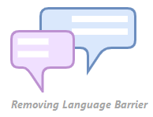

# LangChat

LangChat is very similar to regular chat application, wherein users communicate with each other using messages over the internet. What langChat brings in new is the idea of removing language barriers in such a communication system.

We intend to target users who have communication barriers due to language restrictions. Using this application for same language communication is of no use, Much better apps already exist like Whatsapp, Telegram, Signal and etc.

LangChat automatically translates messages (text and audio) made by the other user in some language to the language set by user himself. 

Since variety of languages and nuances exist in the world, language barrier in communication does exist, LangChat is developed to remove this barrier.

Working :- You will send and receive text and audio messages in language of your own choice. On long press on message bubble you can also see message of sender in his/her language. You can also listen audio message in original lanuguage. While app is in background or is terminated only then you will receive Notification i.e. application only handles background notifications, not foreground notifications.

Languages Supported are:
1. English
2. Spanish
3. Gujarati
4. German
5. Hindi
6. French
Application can obviously be extended to more languages 😏, but for now these are supported.

